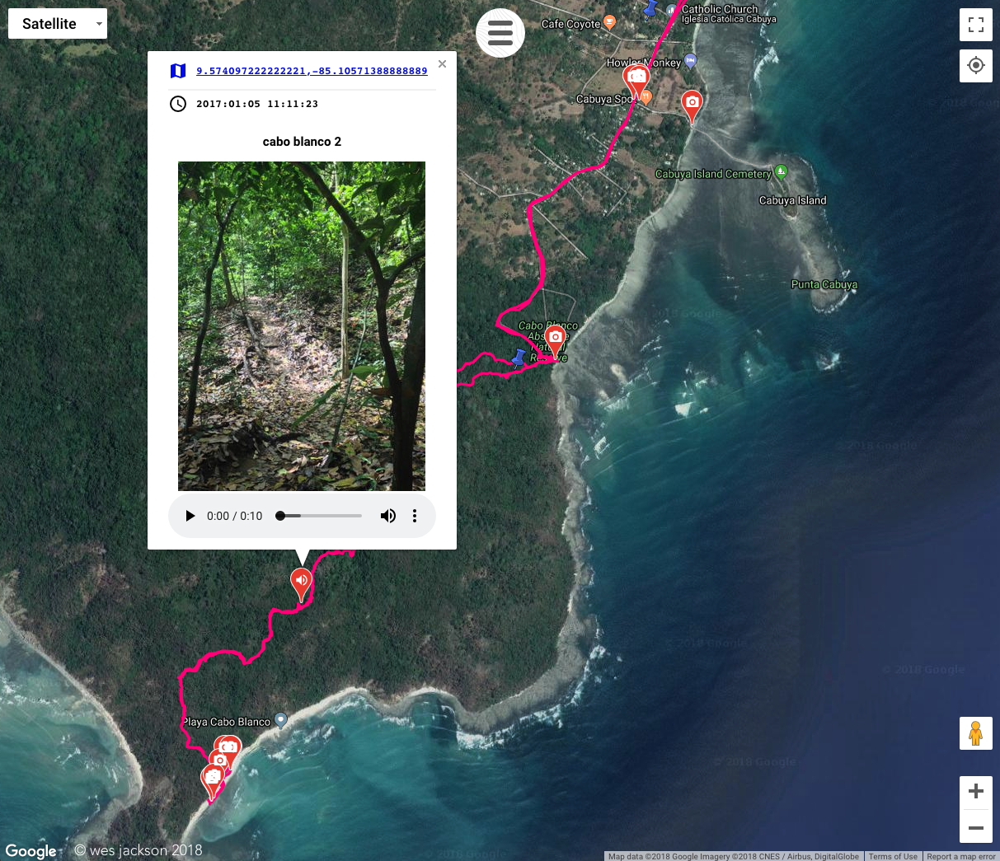
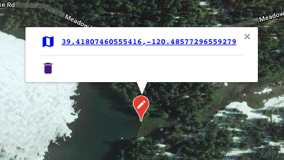

# multimap

## See it in action
https://spectralliaisons.github.io/multimap/

## Overlay gps tracks on Google Maps with pins for photos and audio taken.


## Click map to add map marker


## Dependencies

### Amazon s3
1. Create an Amazon AWS S3 bucket called "s3" and obtain your access and secret key.
2. Install s3cmd: `brew install s3cmd`
3. Maybe create environment vars in your bashrc/zshrc: S3_ACCESS_KEY and S3_SECRET_KEY or just specify them for rake commands for pushing to s3.

### Python
```
pip install notebook
pip install Pillow
pip install ipywidgets
```

## Adding a track with images and optional audio:

1. Create a directory for the place in `gps/s3/`. Copy `gps/_PlaceTemplate/` to use as a template.

2. Add any kml files you may have in kml/. Kml can come from your gps and e.g. [caltopo](https://caltopo.com/m/A912).

3. Add any images you may have in img/. Don't add anything to imgErr/ or imgSm/; these will be filled by a sript you'll run in a bit. If the python script finds GPS coordinates in the image, it will create a map marker on the map that, when clicked, will show the image, image name, and an audio file if one is found with the same name as this image.

4. Add any audio files you may have in aud/. File name sans extension must match an image with valid GPS coordinates or else will not appear.

5. Modify `/info_template.json`, which specifies basic map style for this place: Add a `loc` at where you want to center the map with `label` and match `center` to `label`; e.g.:

```
{
  "zoom":15,
  "center":"head of the russian river",
  "mapType":"hybrid",
  "locations":[
    {
      "label":"head of the russian river",
      "loc":{"lat": 39.3816387, "lng": -123.2364948},
      "img":null,
      "aud":null
    }
  ]
}
```

6. Run the [Jupyter Notebook](http://jupyter.org/install.html) `gps/python/process_places.ipynb` <sup>1</sup>. This is the data file for placing images, audio, KML on Google Maps. If your directories are syntactically kosher, this python script will generate info.json files for every directory in gps/s3/. Info.json is loaded in  `script/gpstracker.js `. 

7. Upload `gps/s3/` to Amazon AWS (the url of the variable `origin` in gpstracker) and make the new place directory publicly visible <sup>1</sup>.
Google Maps API needs kml to be hosted from a publicly-visible location. Even during development, it's necessary to upload your new place directory and make sure it is publicly visible. Technically, we only need kml to be public (not images, audio, json), but I'd rather let `gpstracker.js` get all resources from one url rather than splitting resources.

8. View `index.html` to see your new favorite map.

<sup>1</sup> Available as rake tasks (run ```rake -T``` to see a list of commands). Always remember to never commit your AWS secret keys, you silly goose!

TODO:
- [ ] Use MapBox instead of Google Maps? GeoJSON will need to be used instead of kml, but [caltopo](https://caltopo.com/m/A912) can export this. Or [convert them](https://mapbox.github.io/togeojson/).
