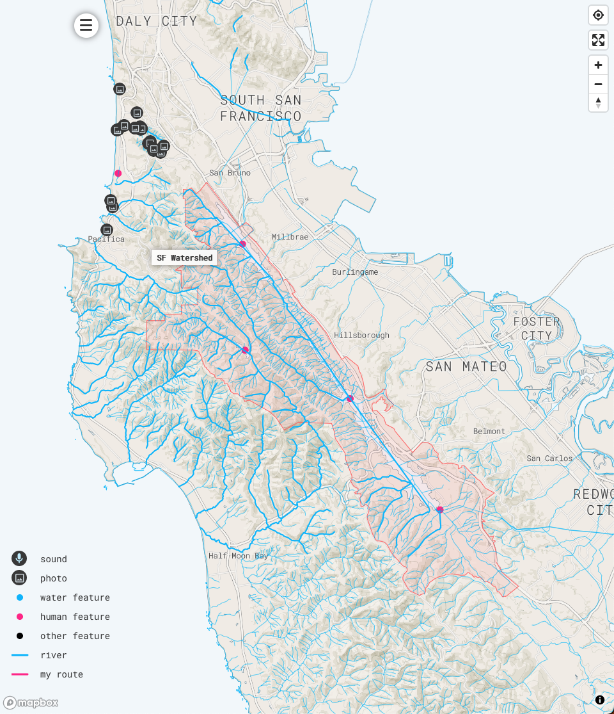

# multimap

## See it in action
https://spectralliaisons.github.io/multimap/

## Overlay gps tracks on Mapbox with markers places where photos and audio were taken, and colorized points for other locations.


## Areas indicated via geojson polygons are also supported; e.g. California watersheds:


## Dependencies

### Amazon s3
1. Create an Amazon AWS S3 bucket called "s3" and obtain your access and secret key.
2. Install s3cmd: `brew install s3cmd`
3. Maybe create environment vars in your bashrc/zshrc: S3_ACCESS_KEY and S3_SECRET_KEY or just specify them for rake commands for pushing to s3.

### Python
```
pip install notebook
pip install Pillow
pip install ipywidgets
pip install wand
pip install numpy
```

### Node modules
```
npm install
npm start
```

open http://localhost:3000/

## Adding a track with images and optional audio:

1. Create a directory for the place in `gps/s3/`. Copy `gps/_PlaceTemplate/` to use as a template.

2. Add any geojson files you may have in `geojson/`. I convert kml files from my gps and [caltopo](https://caltopo.com/m/A912) to geojson using the VSCode Geo Data Viewer extension (randomfractalsinc.geo-data-viewer). Filename prefix indicates how the data will be rendered (see Map.js `addPoints()`):
- `river-`: blue line
- `river-sm-`: thin blue line (no, not that one! -- e.g. to help differentiate river systems)
- `track-`: pink line (in my case this indicates my travel via physical gps tracker)
- `cenote-`: blue dot
- `waypoint-`: pink dot (I use this for manmade points of interest)
- `ruin-`: pink dot

### e.g. differentiated river system


### e.g. differentiating water from archeological features. Note how cenotes form the rim of the Chicxulub impact crater!


### geojson feature properties may include an HTML "description" property that will be displayed in a modal window when the feature is clicked; e.g. rendering information from [East Bay Hill People](https://eastbayhillpeople.com/map/).


3. Add any images you may have in `imgOrig/`. Don't add anything to `imgErr/`, `imgLg/`, or `imgSm/`; these will be filled by a sript you'll run in a bit. If the python script finds GPS coordinates in the image, it will create a map marker on the map that, when clicked, will show the image, image name, and an audio file if one is found with the same name as this image. No locations will be included for images with the prefix `nomarker-` though they still will have large and small copies created--this is useful if you don't want to expose specific locations of images but still show the images in, say, the HTML description of a geojson feature.

4. Add any audio files you may have in `aud/`. File name sans extension must match an image with valid GPS coordinates or else will not appear.

5. Modify `/info_template.json`, which specifies basic map style for this place: Add a `loc` at where you want to center the map with `label` and match `center` to `label`; e.g.:

```
{
  "local":true,
  "zoom":15,
  "center":"head of the russian river",
  "mapType":"hybrid",
  "locations":[
    {
      "label":"head of the russian river",
      "loc":{"lat": 39.3816387, "lng": -123.2364948},
      "img":null,
      "aud":null
    }
  ],
  "desc":"<div>You can add html here for an informational footer.</div>"
}
```

`local` is an optional property that only shows this place in the menu during development (at localhost:3000).

6. Run the [Jupyter Notebook](http://jupyter.org/install.html) `gps/python/process_places.ipynb` <sup>1</sup>. This is the data file for placing images, audio, geojson on the map. If your directories are syntactically kosher, this python script will generate info.json files for every directory in gps/s3/.

7. Upload `gps/s3/` to Amazon AWS (the url of the variable `origin` in gpstracker) and make the new place directory publicly visible <sup>1</sup>. Historically, I used Google Maps API, which used kml instead of geojson and required kml to be hosted from a publicly-visible location. Not sure if this is true after the switch to Mapbox.

8. Configure your site's settings in `src/Config.js`: this contains your `mapboxgl.accessToken`, s3 bucket url, and other parameters.

9. View `public/index.html` at `localhost:3000` to see your new favorite map.

<sup>1</sup> Available as rake tasks (run ```rake -T``` to see a list of commands). Always remember to never commit your AWS secret keys, you silly goose! E.g. to just push media files for a directory named Somewhere in `gps/s3/Somewhere`, run: `rake push:media place=Somewhere`

### Production build
`npm run deploy` (I follow steps for deploying to Github Pages in the [React deployment docs](https://create-react-app.dev/docs/deployment))
